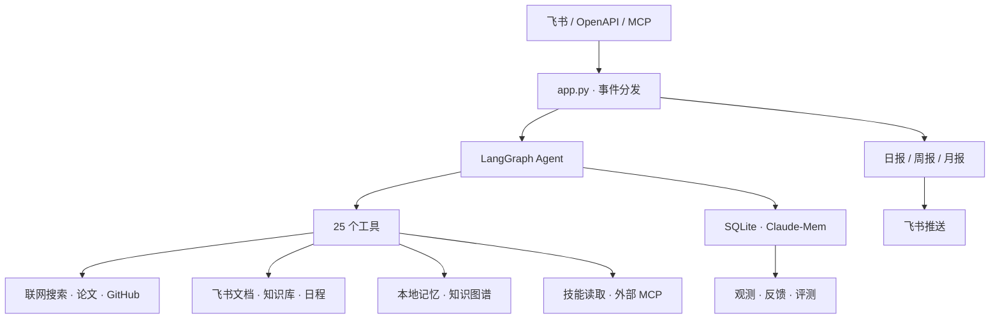

# Kairós

[](https://github.com/DreamZhongJu/kairos-intel/actions/workflows/ci.yml)
[](https://www.python.org/)
[](LICENSE)

一个自托管的多渠道个人情报助手（品牌名 Kairós，前身「飞书研究助手」）。部署者可以自行设定名称与人格，本项目不绑定特定角色名。

---

## 架构



## 能力全景

### 对话式研究助手
- 飞书私聊 / 群聊（@ 触发），服务端 WS 长连接
- 25 个注册工具，LangGraph 自主编排调用
- 回答带**可校验的引用来源**（检索路径 + 实际链接）
- 长回答**分段发送 + 占位消息**，体验流畅
- 多模型路由（按问题复杂度自动选模型）

### 知识管理
- **分层长期记忆**（核心记忆 + 存档记忆，SQLite 持久化）
- **本地知识图谱**（零向量模型，FTS5 关键词 + 实体关系图，支持"湖北大学和机器翻译什么关系"）
- 飞书云文档 / 知识库 / 日程读写（需 OAuth 授权）
- **外部技能系统**：62 个研究技能按需加载（`skill_list` / `skill_load`）

### 情报日报体系
- 每日 09:00 自动聚合（社会/科技/开源/研究/新技术/每周团队），含 GitHub Trending
- 每周一 09:05 周报 / 每月 1 日 09:10 月报（汇总日报 + 用量 + 记忆）
- 可配置推送目标（飞书大脑通道 / 自定义 webhook）

### 开放与集成
- **MCP 服务**：暴露 11 个工具给外部 AI 客户端（`python -m kairos.server.mcp`）
- **OpenAPI REST**：`/health` `/api/chat` `/api/tools` `/api/reports` `/api/knowledge/stats`（与 app 一起启动，端口 `KAIROS_API_PORT` 默认 8095）
- **MCP 客户端**：可动态接入外部 MCP 工具（`mcp_servers.json`）
- 多 Provider 模型（DeepSeek / OpenAI / Qwen / Moonshot / 智谱 / SiliconFlow / OpenRouter / Ollama）

### 观测与质量
- Web 面板（仪表盘 / 日志 / 记忆 / 运行状态）
- 离线评测套件（honesty / relevancy / 工具路由，13 问答 + 10 路由）
- **反馈闭环**：用户 emoji 反应（👍/👎）入库，差评可回溯复测
- CI 在无凭据环境跑全部 79 个单测

## 快速开始

```bash
# 复制配置
cp .env.example .env   # 填 LARK_APP_ID / LARK_APP_SECRET / DEEPSEEK_API_KEY

# 安装依赖
pip install -r requirements.txt

# 跑测试（无需密钥）
python -m unittest discover -s tests -v

# 启动（飞书 WS + OpenAPI + 调度器）
python app.py
```

Docker Compose 一键部署（含代理、cloudflared tunnel）：

```bash
docker compose up -d --build kairos
```

## 配置速查

| 变量 | 默认 | 说明 |
| --- | --- | --- |
| `DEEPSEEK_API_KEY` | — | 模型 API Key |
| `MODEL_PROVIDER` | `deepseek` | 模型提供方（openai / qwen / moonshot / zhipu / siliconflow / openrouter / ollama） |
| `LARK_APP_ID` / `LARK_APP_SECRET` | — | 飞书自建应用凭据 |
| `FEISHU_REPORT_CHAT_ID` | — | 日报推送目标（大脑通道） |
| `FEISHU_WEBHOOK_URL` | — | 日报推送回退（webhook） |
| `SKILL_API_URL` | — | 外部技能读取服务地址 |
| `KAIROS_API_PORT` | `8095` | OpenAPI 服务端口 |
| `ROUTER_STRONG_MODEL` | — | 复杂问题的模型（多模型路由） |

完整配置见 `.env.example`。

## 代码结构

```
kairos/
├── agent/          LangGraph 工具调用图 + 引用脚注 + 路由
├── tools/          搜索、网页、论文、GitHub、飞书文档、知识库、技能
├── channels/       飞书消息与 API 传输（分块、撤回）
├── memory/         SQLite 分层记忆 + Claude-Mem
├── knowledge/      本地知识图谱（FTS5 + 实体关系图，无向量）
├── reports/        日报 / 周报 / 月报生成与调度
├── server/         MCP 服务 + OpenAPI REST
├── infrastructure/ 模型层、设置、多 Provider 路由
└── observability/  请求日志、指标、反馈闭环
```

## 路线图

- [x] 飞书对话 + 工具调用 + 长期记忆
- [x] 每日情报日报 + 周报 / 月报
- [x] 回答引用来源（verifiable citations）
- [x] 分段回复 + 占位进度
- [x] 本地知识图谱（无 embedding）
- [x] 外部技能接口 + 62 个研究技能
- [x] MCP 服务 + OpenAPI REST
- [x] 反馈闭环（👍/👎 入库）
- [x] 多模型路由
- [ ] 用户级订阅推送
- [ ] 多模态（语音 / 图片）
- [ ] 反馈驱动的自动化评测回测

## 贡献

见 [CONTRIBUTING.md](CONTRIBUTING.md)。欢迎 Issue / PR。

## 许可证

MIT — 详见 [LICENSE](LICENSE)。第三方依赖许可证见 [THIRD_PARTY_NOTICES.md](THIRD_PARTY_NOTICES.md)。